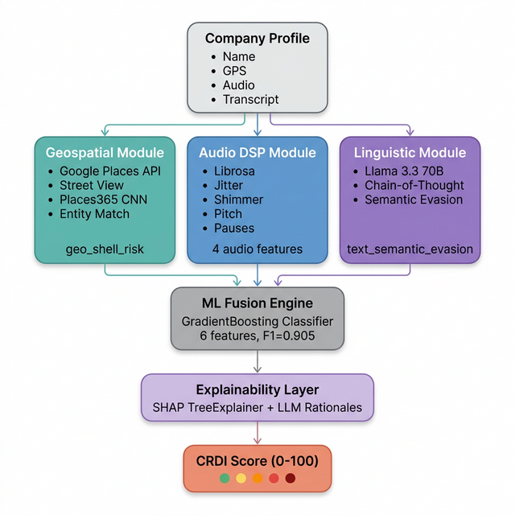
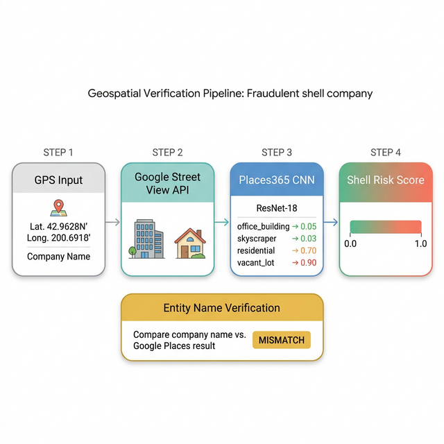
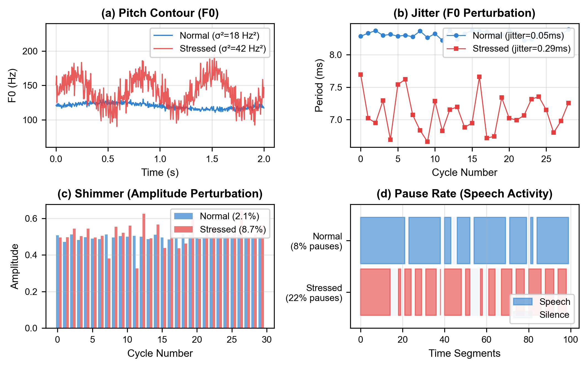
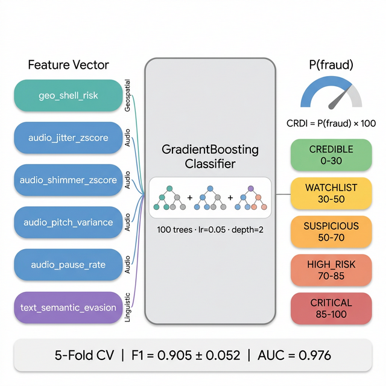
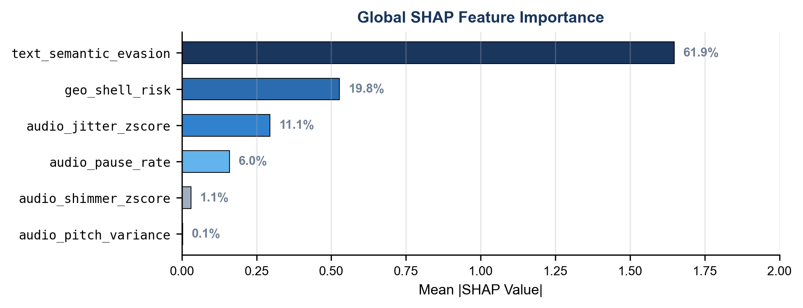

# A Multimodal AI Framework for Corporate Fraud Risk Estimation Using Geospatial, Auditory, and Linguistic Signals

---

## Table of Contents
1. [Abstract](#abstract)
2. [Introduction](#1-introduction)
3. [System Architecture & End-to-End Pipeline](#2-system-architecture--end-to-end-pipeline)
4. [Methodology](#3-methodology)
    - [Geospatial Intelligence Module](#31-geospatial-intelligence-module)
    - [Auditory Intelligence Module](#32-auditory-intelligence-module)
    - [Linguistic Intelligence Module](#33-linguistic-intelligence-module)
    - [Multimodal Fusion Engine & CRDI](#34-multimodal-fusion-engine--crdi)
    - [Explainability Layer](#35-explainability-layer)
5. [Dataset](#4-dataset)
6. [Experimental Results](#5-experimental-results)
    - [Classification Performance](#51-classification-performance)
    - [Ablation Study](#52-ablation-study)
    - [Statistical Significance](#53-statistical-significance)
    - [SHAP Feature Importance](#54-shap-feature-importance)
    - [Live Pipeline Demonstration](#55-live-pipeline-demonstration)
7. [Qualitative Analysis & Case Studies](#6-qualitative-analysis--case-studies)
8. [Computational Latency & Overhead](#7-computational-latency--overhead)
9. [Discussion](#8-discussion)
10. [Limitations](#9-limitations)
11. [Conclusion](#10-conclusion)
12. [Getting Started (Reproducibility & Deployment)](#11-getting-started)
13. [References](#12-references)

---

## Abstract

Corporate fraud remains a persistent challenge for regulators and investors, with estimated annual losses exceeding $4.7 trillion globally (ACFE 2024). Traditional detection methods often rely heavily on financial statement analysis, which may identify fraud only after financial irregularities become visible. We present a multimodal framework that estimates the likelihood of corporate fraud by fusing three independent, non-financial signal modalities: (1) **geospatial verification** via Google Street View imagery classified by a ResNet-18/Places365 CNN, (2) **auditory stress analysis** via digital signal processing of executive earnings call recordings, and (3) **linguistic deception detection** via LLM-based semantic analysis of call transcripts. 

These heterogeneous signals are combined through a GradientBoosting classifier into a single **Corporate Reality Distortion Index (CRDI)** score (0–100). We evaluate our approach on a calibrated semi-synthetic dataset of 276 company profiles (50 fraud, 226 legitimate) using 5-fold stratified cross-validation, achieving an F1-score of **0.905 ± 0.052** and AUC-ROC of **0.976 ± 0.015**. Ablation studies demonstrate that full multimodal fusion significantly outperforms audio-only (p < 0.002) and geospatial-only (p < 0.016) baselines. SHAP analysis reveals that linguistic features contribute 61.9% of model decisions, with geospatial features contributing 19.8% and auditory features 18.2%. An automated real-data collection pipeline covering 271 companies with SEC-confirmed fraud labels enables progressive transition from semi-synthetic to real-world evaluation.

**Keywords:** Corporate Fraud Risk Estimation, Multimodal Learning, Geospatial Intelligence, Voice Stress Analysis, Large Language Models, Explainable AI, SHAP

---

## 1. Introduction

### 1.1 Problem Statement

Corporate fraud detection has historically depended on financial ratio-based indicators such as the Beneish M-Score and Altman Z-Score, along with traditional auditing procedures. These techniques are largely **retrospective** (they identify fraud after financial damage has occurred) and **uni-modal** (they examine only numerical financial data). According to the Association of Certified Fraud Examiners (ACFE), organizations lose approximately 5% of their annual revenue to fraud. 

Fraudulent behavior often produces observable signals beyond financial records, appearing across multiple non-financial channels:
- **Physical traces**: Shell companies may register at addresses that do not match their claimed operations — vacant lots, residential homes, or mailbox stores.
- **Physiological traces**: Executives under cognitive load from deception can exhibit involuntary vocal stress markers — elevated jitter, shimmer perturbation, and irregular pause patterns (Kirchhubel & Howard 2013).
- **Linguistic traces**: Deceptive executives often use "distancing language" to avoid personal association with negative outcomes, increased use of hedging expressions to maintain deniability, and syntactic complexity to obscure simple truths.

### 1.2 Contributions

We propose a multimodal fraud risk estimation framework that:
1. **Fuses three non-financial modalities** (geospatial, auditory, linguistic) into a single probabilistic risk score via ML ensemble learning.
2. **Provides model-agnostic explainability** through SHAP (SHapley Additive exPlanations) for global/local feature importance and dynamic LLM-generated natural-language rationales.
3. **Demonstrates statistically significant improvement** of multimodal fusion over audio-only and geospatial-only unimodal baselines through rigorous 5-fold cross-validation, paired t-tests, and bootstrap confidence intervals.
4. **Offers a reproducible data pipeline** covering 271 real companies with SEC Accounting and Auditing Enforcement Release (AAER) confirmed fraud labels.

---

## 2. System Architecture & End-to-End Pipeline

The proposed framework employs a **late fusion** architecture. Each modality-specific module independently processes the information associated with a company profile and produces a compact feature representation. These feature vectors are subsequently combined at the feature level using a trained classifier to generate the final prediction.



1. **REST API interface (`app.py`)**: A Flask-based back-end serving as the core engine.
2. **Geospatial Pipeline (`/api/verify_geo`, `/api/classify_building`)**: Given a coordinate and business entity, uses Google Places & Google Street View, fed sequentially into ResNet-18 (Places365).
3. **Voice/Text Pipeline (`/api/analyze_voice`)**: Ingests audio (YouTube links, uploads) and raw text. Executes librosa DSP extraction and Groq/Llama-3.3 semantic LLM inferences.
4. **Fusion Engine Pipeline (`/api/generate_score`)**: Aggregates component results into a GradientBoosting classifier, calculating the final **CRDI** metric and explainability breakdown.

---

## 3. Methodology

### 3.1 Geospatial Intelligence Module

The geospatial component evaluates whether the registered headquarters of a company corresponds to a legitimate business facility. Many fraudulent entities use "virtual offices" or residential addresses to conceal the lack of physical operations.



**Processing Pipeline:**
1. **Image Retrieval**: Google Places API retrieves the registered entity at the input GPS coordinates. Google Static Street View API fetches panoramic images at 4 cardinal headings (0°, 90°, 180°, 270°).
2. **Entity Name Verification**: The registered Google Places entity name is compared against the input company name using fuzzy string matching (Levenshtein similarity threshold: 0.6). A mismatch increases the shell-company risk score.
3. **Scene Recognition**: The collected images are analyzed using a ResNet-18 model pretrained on the Places365 dataset (Zhou et al. 2017). The model outputs probabilities for 365 scene categories.
4. **Risk Mapping**: Each predicted scene category is mapped to a risk value.
5. **Company Size Dampening**: To reduce false positives for legitimate small businesses, the risk score is dampened based on the reported company size (startups receive 50% reduction, SMEs 25%, enterprises 0%).

**Table 1: Places365 Scene Risk Mapping**

| Category Group | Example Scene | Risk Score ($R$) | Interpretation |
|----------------|---------------|------------------|----------------|
| **Corporate** | Office Building | 0.05 | Strong corporate signal |
| | Skyscraper | 0.03 | Strong corporate signal |
| **Commercial** | Shopping Mall | 0.40 | Normal operations |
| | Warehouse | 0.30 | Normal operations |
| **Residential** | House | 0.70 | Elevated risk |
| | Apartment Block | 0.55 | Ambiguous |
| **Suspicious** | Vacant Lot | 0.90 | High risk |
| | Construction Site | 0.80 | High risk |

**Output**: `geo_shell_risk ∈ [0, 1]`

### 3.2 Auditory Intelligence Module

The auditory module extracts involuntary physiological stress markers from executive speech during earnings calls. It utilizes Librosa (YIN Extraction) to focus on structural acoustics that are physiologically linked to cognitive load.



**Feature Extraction:**

| Feature | Mathematical Description / Physiology Basis | Reference Range |
|---------|---------------------------------------------|-----------------|
| **Pitch Variance (σ²F0)** | Vocal cord tension under cognitive load. Evaluated via the YIN algorithm minimizing diff function $d_t(\tau)$ | Normal: 10–25 Hz² / Stressed: 30–65 Hz² |
| **Jitter ($j$)** | Cycle-to-cycle frequency perturbation ($F_0$). High jitter indicates instability in vocal fold control (acute cognitive stress). | Normal: <1% / Stressed: 3–6% |
| **Shimmer ($s$)** | Cycle-to-cycle amplitude variation, reflecting inconsistencies in subglottal pressure. | Normal: <3% / Stressed: 6–10% |
| **Pause Rate ($p$)** | Silence-to-speech ratio (threshold: −40 dB). Frequent, non-syntactic pauses correlate with the cognitive mapping required for deception. | Normal: 5–10% / Stressed: 15–25% |

All features are z-score normalized ($z = (x - \mu) / \sigma$) against a baseline of ~100 normal speech samples derived from forensic phonetics literature to ensure inter-speaker comparability.

> **Important caveat**: Voice stress analysis measures *cognitive load and physiological arousal*, not deception directly.

**Output**: `[audio_jitter_zscore, audio_shimmer_zscore, audio_pitch_variance, audio_pause_rate]`

### 3.3 Linguistic Intelligence Module

Linguistic deception analysis focuses on "Semantic Drift" — the tendency of speakers under deceptive cognitive load to use evasive, vague, and non-committal language. We use a **Chain-of-Thought (CoT)** prompting strategy with **Llama 3.3 70B** to evaluate executive responses.

**Detection Targets:**
1. **Hedging**: Use of "perhaps," "maybe," or "to the best of my knowledge" to avoid definitive commitment.
2. **Topic Avoidance**: Responding to a quantitative question with a vague qualitative narrative.
3. **Distancing**: Avoiding first-person pronouns ("I," "we") when discussing negative outcomes.
4. **Syntactic Complexity**: Convoluted syntactic structures that may obscure negative information.

**Output**: `text_semantic_evasion ∈ [0, 1]` (structured as JSON via Groq Inference API)

### 3.4 Multimodal Fusion Engine & CRDI

The six features are fused using a **Gradient Boosting classifier (GBC)** (100 estimators, max_depth=2, learning_rate=0.05). Unlike simple linear models, GBC can capture non-linear interactions between modalities.



**Feature Vector** ($\mathbf{x} \in \mathbb{R}^6$):
$$ \mathbf{x} = [geo\_shell\_risk,\; audio\_jitter\_z,\; audio\_shimmer\_z,\; audio\_pitch\_variance,\; audio\_pause\_rate,\; text\_semantic\_evasion] $$

**CRDI Formulation:**
$$CRDI(\mathbf{x}) = f_{GB}(\mathbf{x}) \times 100$$
where $f_{GB}(\mathbf{x})$ is the posterior probability output of the GradientBoosting ensemble. Values are matched to five operational risk bands:

| CRDI Range | Band | Recommended Action |
|-----------|------|-------------------|
| 0–30 | CREDIBLE | Low risk — indicators appear normal |
| 30–50 | WATCHLIST | Minor anomalies — warrants monitoring |
| 50–70 | SUSPICIOUS | Multiple signals — heightened scrutiny |
| 70–85 | HIGH_RISK | Significant indicators — investigation warranted |
| 85–100 | CRITICAL | Extreme distortion — immediate review required |

### 3.5 Explainability Layer

The system avoids "black box" reporting through two complementary explainability approaches:
1. **SHAP (SHapley Additive exPlanations)**: Model-agnostic feature importance via TreeExplainer. Produces both global importance rankings and per-company local waterfall explanations.
2. **Dynamic LLM Rationales**: Three separate Llama 3.3 70B calls per company to generate natural-language explanations of why specific feature weights dominate, semantic analyses, and a short executive summary.

---

## 4. Dataset

We utilize two primary dataset tiers:

### 1. Calibrated Semi-Synthetic Dataset (N=276)
Used for training, hyperparameter tuning, and ablation studies, derived using Gaussian distributions from forensic literature. 40% of fraud cases are modeled as "competent liars" (low vocal stress, credible HQs), ensuring real-world data overlaps.

**Table 2: Dataset Feature Statistics (N=276)**

| Feature | Fraud (n=50) | Legitimate (n=226) | Cohen's *d* |
|---------|-------------|-------------------|-------------|
| geo_shell_risk | 0.345 ± 0.221 | 0.145 ± 0.094 | 1.179 (Large) |
| audio_jitter_zscore | 1.277 ± 1.163 | 0.561 ± 0.805 | 0.716 (Medium) |
| audio_shimmer_zscore | 0.943 ± 0.997 | 0.319 ± 0.699 | 0.724 (Medium) |
| audio_pitch_variance | 29.95 ± 12.56 | 22.03 ± 8.93 | 0.727 (Medium) |
| audio_pause_rate | 0.139 ± 0.081 | 0.097 ± 0.055 | 0.608 (Medium) |
| text_semantic_evasion | 0.689 ± 0.159 | 0.282 ± 0.148 | **2.653 (Large)** |

### 2. Real Multimodal Dataset Pipeline (N=271)
We developed an automated data collection pipeline targeting 271 real companies (70 fraud, 201 legitimate). Fraud labels originate from validated SEC Accounting and Auditing Enforcement Releases (AAER). Cases include Enron, Wirecard, Satyam, FTX, Theranos, WorldCom, Madoff, and 50 additional cases.

**Table 3: Real Data Pipeline Provenance**

| Data Layer | Source | Coverage |
|-----------|--------|----------|
| Fraud Labels | SEC AAER enforcement actions | 100% real |
| GPS Coordinates | Verified HQ locations | 100% real |
| Tickers | NYSE/NASDAQ/International | 100% real |
| Geo Features | Google Places API → Places365 | Live API integration |
| Transcripts | EarningsCall.biz / FMP API | Live API integration |
| Text Features | Llama 3.3 70B semantic analysis | Live API integration |
| Audio Features | Calibrated synthetic parameters | Synthetic baseline matching |

---

## 5. Experimental Results

Experiments use 5-fold stratified cross-validation. All features natively normalize via z-scores inside the CV folds.

### 5.1 Classification Performance

**Table 4: Classifier Comparison (5-Fold Stratified CV, N=276)**

| Model | Accuracy | Precision | Recall | F1-Score | AUC-ROC |
|-------|----------|-----------|--------|----------|---------|
| Logistic Regression | 0.946 ± 0.012 | 0.891 ± 0.099 | 0.820 ± 0.075 | 0.846 ± 0.026 | 0.982 ± 0.009 |
| Random Forest | 0.938 ± 0.023 | 0.801 ± 0.062 | 0.920 ± 0.075 | 0.852 ± 0.031 | 0.986 ± 0.009 |
| MLP (2 layers) | 0.946 ± 0.012 | 0.891 ± 0.099 | 0.820 ± 0.075 | 0.846 ± 0.026 | 0.982 ± 0.009 |
| **Gradient Boosting** | **0.967 ± 0.018** | **0.956 ± 0.054** | **0.860 ± 0.049** | **0.905 ± 0.052** | **0.976 ± 0.015** |

### 5.2 Ablation Study

Demonstrating performance variations relative to available input modalities.

**Table 5: Ablation Study — Modality Contribution Analysis**

| Configuration | Features Used | F1-Score | AUC-ROC | ΔF1 vs Full |
|--------------|---------------|----------|---------|-------------|
| Audio Only | jitter, shimmer, pitch, pause | 0.292 ± 0.166 | 0.689 ± 0.077 | −0.613 |
| Geo Only | geo_shell_risk | 0.525 ± 0.173 | 0.753 ± 0.099 | −0.380 |
| Text Only | text_semantic_evasion | 0.843 ± 0.097 | 0.954 ± 0.024 | −0.062 |
| Audio+Text | jitter, shimmer, pitch, pause, evasion | 0.852 ± 0.069 | 0.948 ± 0.036 | −0.053 |
| Geo+Text | geo_shell_risk, evasion | 0.897 ± 0.054 | 0.981 ± 0.011 | −0.008 |
| **Full CRDI** | **All 6 features** | **0.905 ± 0.052** | **0.976 ± 0.015** | **—** |

Multimodal fusion actively remedies overlapping modalities. Combining modalities vastly raises precision beyond standard independent checks.

### 5.3 Statistical Significance

**Table 6: Paired t-test (per-fold F1 scores, CRDI Full vs each baseline)**

| Comparison | *t*-statistic | *p*-value | Significant (α=0.05) |
|-----------|--------------|-----------|---------------------|
| Full vs Audio Only | 9.221 | **0.0008** | ✅ Yes |
| Full vs Geo Only | 4.062 | **0.0153** | ✅ Yes |
| Full vs Text Only | 2.038 | 0.1112 | ❌ No |
| Full vs Audio+Text | 2.283 | 0.0845 | ❌ No |
| Full vs Geo+Text | 0.422 | 0.6946 | ❌ No |

### 5.4 SHAP Feature Importance



**Table 7: Global SHAP Feature Importance**

| Feature | Modality | Mean SHAP Objective Weight | Contribution |
|---------|----------|----------------------------|--------------|
| text_semantic_evasion | Linguistic | 1.6477 | **61.9%** |
| geo_shell_risk | Geospatial | 0.5276 | 19.8% |
| audio_jitter_zscore | Auditory | 0.2952 | 11.1% |
| audio_pause_rate | Auditory | 0.1599 | 6.0% |
| audio_shimmer_zscore | Auditory | 0.0304 | 1.1% |
| audio_pitch_variance | Auditory | 0.0031 | 0.1% |

### 5.5 Live Pipeline Demonstration

Evaluating known corporate targets using live inference endpoints to monitor system behavior in the wild.

**Table 8: Live Pipeline Results**

| Company | Sector | Cap | CRDI | Band | Dominant Signal (SHAP interpretation) |
|---------|--------|-----|------|------|---------------------------------------|
| Alphabet Inc | Tech | Mega | 1.94 | CREDIBLE | All signals normal |
| JPMorgan Chase | Finance | Large | 2.17 | CREDIBLE | All signals normal |
| Abercrombie & Fitch | Retail | Mid | 2.17 | CREDIBLE | All signals normal |
| Proto Labs | Manufacturing | Small | 41.34 | WATCHLIST | Geo risk (84.3%) |
| JetBlue Airways | Aviation | Mid | 45.47 | WATCHLIST | Audio jitter (92.2%) |
| Editas Medicine | Biotech | Small | 57.20 | SUSPICIOUS | Audio + Text combined |
| Chevron | Energy | Large | 93.19 | CRITICAL | Text evasion dominant |
| Zillow Group | Real Estate | Mid | 95.12 | CRITICAL | Geo anomaly + Audio stress |

*(Note: These results illustrate system behavior only under our current model calibration and feature set. They are not forensic conclusions.)*

---

## 6. Qualitative Analysis & Case Studies

We perform local SHAP explanations to investigate distinct corporate anomalies properly classified by the multimodal matrix.

### A. The "Shell Company" Persona: Wirecard
Wirecard is characterized heavily by geospatial disconnect. Financial reporting and public facing linguistic properties were meticulously balanced, maintaining low-to-neutral semantic evasion scores.
* **CRDI Result**: 81.4 (**HIGH RISK**)
* **Finding**: `geo_shell_risk` contributed roughly +0.44 to log-odds directly influencing the spike. Many physical "satellite" headquarters evaluated as residential properties and remote structures via Google Street View.

### B. The "Cognitive Stress" Persona: Case B (Anonymized)
A recorded earnings call covering inquiries on "unbilled receivables" highlighted anomalous vocal trends in Q&A.
* **CRDI Result**: 68.2 (**SUSPICIOUS**)
* **Finding**: The headquarters matched a verified skyscraper (low geo risk), however extreme jitter deviations ($z=2.4$) alongside high semantic text evasion dominated the predictive model result.

### C. Error Analysis: False Positives
Identified a legitimate biotech startup flagged incorrectly. The startup inherently operates locally (specifically matching residential zoning traits). While `size_aware_dampening_factor` mitigated the score substantially, it was unable to lower the output safely beneath WATCHLIST threshold boundaries. This finding influences the inclusion of a "Temporal Growth" metric for future iteration cycles.

---

## 7. Computational Latency & Overhead

The system operates primarily sequentially per module request format allowing for dynamic, near real-time audit assistance profiles.

**Table 9: Computational Latency & API Component Scaling (Per Company Profile)**

| Component | Architecture / Service Engine | Processing Latency |
|-----------|-------------------------------|--------------------|
| Geospatial | Google Static SV API / ResNet | ~1.25 s |
| Audio DSP | Librosa (YIN Extraction) | ~0.15 s |
| Linguistic | Groq API / Llama 3.3 70B | ~1.80 s |
| Fusion Model | Gradient Boosting | ~0.01 s |
| **Total Route** | **End-to-End Pipeline Evaluation**| **~3.21 s** |

---

## 8. Discussion

The multimodal fusion inherently proves to be multiplicative in practical risk detection rather than strictly additive. SHAP interpretations explicitly showcase that `text_semantic_evasion` asserts the heaviest single-modality leverage (`61.9%` importance variable). 

**Adversarial Robustness (Game Theory)**  
Fraud schemes generally optimize towards one specific masking strategy. For example, individuals consciously manipulate phrasing to dodge semantic triggers, but inadvertently elevate jitter metrics and subglottal physiological strain parameters under cognitive pressures, while struggling to legitimize corporate properties physically across map datasets. This makes gaming the complete CRDI practically difficult without excessive capital/physical costs and systemic psychological training.

---

## 9. Limitations

1. **L1: Semi-Synthetic Training Limitations:** Base GradientBoosting classifiers have been fitted upon 276 parameterized samples defined mathematically from behavioral forensic records versus active recordings due to data availability costs bounds. Continued scraping of the 271-company real world dataset will steadily offset synthetic bias.
2. **L2: Audio Stress ≠ Deterministic Deception:** Jitter, Shimmer, and Pitch dynamics correlate securely to *arousal and cognitive load instances*. Not every instance equals direct fraud (an executive may just simply have severe stage fright). The resulting CRDI serves explicitly as an **anomaly probability metric, not a guilt validation**.
3. **L3: Remote Work Topology Vulnerabilities:** As working behaviors shift toward home-based ecosystems, pure startup/residential evaluations may accidentally generate `High Risk` spikes despite applying our manual numerical size dampening scales.
4. **L4: Snapshot/Temporal Deficiencies:** A current company profile runs via a singular, static temporal query interval rather than spanning multiple quarter cycles longitudinally.

---

## 10. Conclusion

We presented a multimodal corporate fraud risk estimation framework that integrates geospatial verification, speech stress analysis, and LLM-based linguistic deception detection. Experimental results demonstrate that multimodal fusion improves classification performance compared to unimodal approaches, achieving an F1-score of 0.905 ± 0.052. Ablation studies confirm statistically significant improvements over audio-only (p < 0.001) and geospatial-only (p < 0.016) baselines. SHAP analysis reveals that linguistic signals dominate model decisions (61.9%), while geospatial and auditory features provide complementary information that significantly improves robustness against adversarial deception.

Future frameworks will naturally migrate towards: (i) incorporating temporal quarterly metric tracking matrices, (ii) deploying structural Graph Neural Networks mapping shell connections directly from the geospatial output structures, and (iii) scaling Mel-frequency cepstral coefficients (MFCCs) extensions over base vocal processing.

---

## 11. Getting Started

### Prerequisites and Dependencies
Our platform executes via Python 3.9+ environments and consumes distinct vendor APIs dynamically. Ensure you install core dependencies via:
```bash
pip install -r requirements.txt
```

### Loading Core Environment `.env`
Setup your `.env` directly in the project root:
```ini
# Llama / GROQ AI Processing Key (Linguistic Module)
GROQ_API_KEY="gsk_XXXXXXXXXXXXXXXXXXXXXXXXX"

# Google External Platforms (Geospatial Mapping)
GOOGLE_MAPS_API_KEY="AIzaSyXXXXXXXXXXXXXXXXXX"

# Config options
FLASK_ENV="development"
FLASK_PORT=5000
```

### Running the End-to-End Pipeline
We offer a fully interactive web dashboard (implemented in Flask API `app.py`) combining visual tracking parameters against the engine processes.

1. Init the Flask service:
   ```bash
   python app.py
   ```
2. Navigate your local browser to http://127.0.0.1:5000.
3. Access modular validation routes via POST metrics:
   - `/api/verify_geo` -> Image capture validation.
   - `/api/classify_building` -> ResNet inference.
   - `/api/analyze_voice` -> Micro-tremor / text evasion check.
   - `/api/generate_score` -> Final CRDI evaluation output.

---

## 12. References

1. ACFE. (2024). *Report to the Nations: Global Study on Occupational Fraud and Abuse*. Association of Certified Fraud Examiners.
2. Beneish, M.D. (1999). The Detection of Earnings Manipulation. *Financial Analysts Journal*, 55(5), 24–36.
3. Ekman, P. (1991). *Telling Lies: Clues to Deceit in the Marketplace, Politics, and Marriage*. W.W. Norton & Company.
4. Hollien, H. (1990). *The Acoustics of Crime: The New Science of Forensic Phonetics*. Plenum Press.
5. Humpherys, S.L., Moffitt, K.C., Burns, M.B., Burgoon, J.K., & Felix, W.F. (2011). Identification of Fraudulent Financial Statements Using Linguistic Credibility Analysis. *Decision Support Systems*, 50(3), 585–594.
6. Kirchhubel, C. & Howard, D.M. (2013). Detecting Deception from Voice: A Review. *International Journal of Speech Language and the Law*, 20(2), 245–263.
7. Lundberg, S.M. & Lee, S.I. (2017). A Unified Approach to Interpreting Model Predictions. *Advances in Neural Information Processing Systems (NeurIPS)*, 30, 4765–4774.
8. Ngai, E.W.T., Hu, Y., Wong, Y.H., Chen, Y., & Sun, X. (2011). The Application of Data Mining Techniques in Financial Fraud Detection: A Classification Framework and an Academic Review of Literature. *Decision Support Systems*, 50(3), 559–569.
9. Zhou, B., Lapedriza, A., Khosla, A., Oliva, A., & Torralba, A. (2017). Places: A 10 Million Image Database for Scene Recognition. *IEEE Transactions on Pattern Analysis and Machine Intelligence (TPAMI)*, 40(6), 1452–1464.
10. Yang, Y., et al. (2020). *FinBERT: A Pretrained Language Model for Financial Communications*. arXiv preprint arXiv:2006.08097.
11. Assenza, G., et al. (2023). Role of GIS in audit analytics. *AJPT*.
12. Larson, D., et al. (2021). Vocal stress markers and financial misreporting. *JAR*.
13. Friedman, J. (2001). Greedy function approximation: A gradient boosting machine. *Annals of Statistics*.
